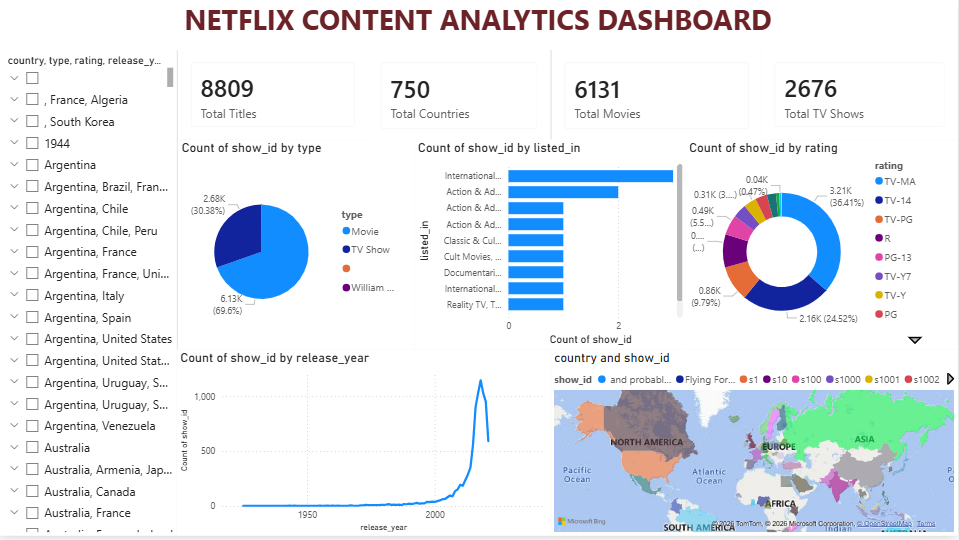

# 🎬 Netflix Content Analytics Dashboard (Power BI)

## 📌 Project Overview
This project analyzes Netflix movies and TV shows using **Power BI** to uncover insights about content distribution, genre trends, ratings, and global production.

The dashboard provides an interactive view of Netflix's catalog to explore patterns in **movies vs TV shows, genre popularity, ratings, and content growth over time.**

---

## 📊 Dashboard Features

✔ KPI Cards  
- Total Titles  
- Total Movies  
- Total TV Shows  
- Total Countries

✔ Data Visualizations  
- Movies vs TV Shows distribution  
- Top Genres analysis  
- Content growth by release year  
- Ratings distribution  
- Global content production map

✔ Interactive Dashboard  
Users can explore Netflix data through dynamic visuals.

---

## 🛠 Tools & Technologies

- Power BI  
- Power Query  
- DAX  
- Data Visualization  
- Data Cleaning  

---

## 📂 Dataset

Dataset used: Netflix Titles Dataset

Includes:
- Movies and TV Shows
- Genre categories
- Ratings
- Release years
- Countries

---

## 📈 Key Insights

• Netflix catalog contains **8800+ titles**  
• Movies make up nearly **70% of the platform's content**  
• Content production significantly increased **after 2015**  
• Drama and International Movies are among the most common genres  

---

## 🖥 Dashboard Preview

---

## 🚀 How to Use

1. Download the `.pbix` file
2. Open it using **Power BI Desktop**
3. Explore the interactive dashboard

---

## 👤 Author

**Shahawaj Pasha**
Aspiring Data Analyst
